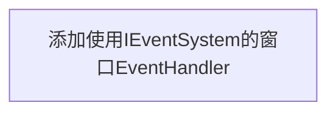
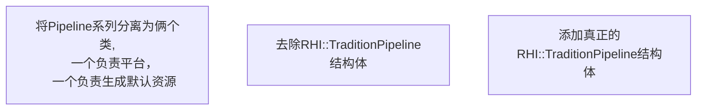
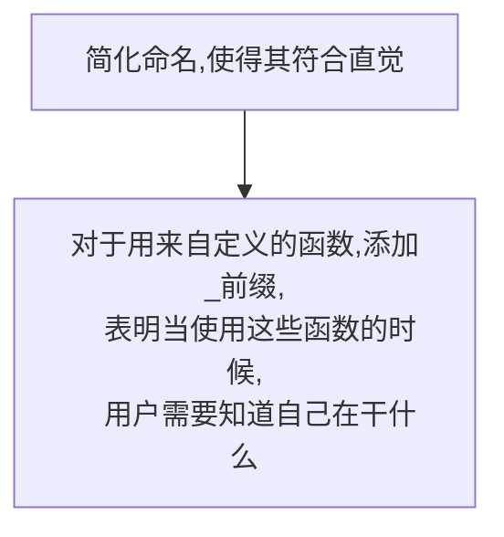
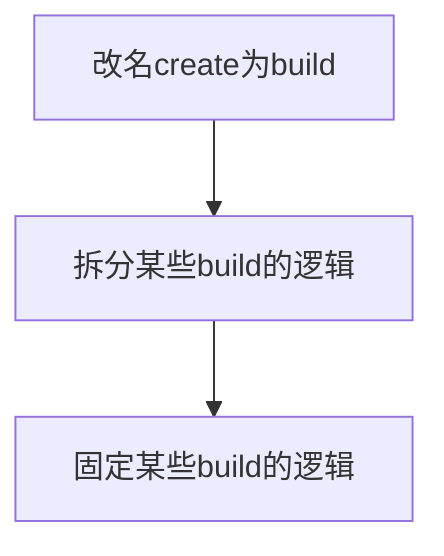

# todo
# [branch]
## 添加事件处理

## 统一new和delete
将不小心使用的new 和 delete 都改为使用FCT_NEW FCT_NEWS FCT_DELETE FCT_DELETES
## 将FCT::Image变为只读
将FCT::Image用来填参数的以及create统一去除，
只用来获取图像信息,可以不去除as,这样用户
要么自行创建MutilBufferImage/SingleBufferImage
要么通过ResourceManager allocate
## frameBuffer Cache
将原本的framebuffer每帧一重建改为根据dirty来检查重建的
FrameBuffer Cache
## 添加合适的提示信息
比如使用者vulkan版本低于1.2，应当提示vulkan版本低于1.2,需升级驱动，然后exit
如果用户运行的是debug版本，且没有验证层时应报错并提示安装vulkan sdk，然后exit
## 将ResourceManager改为使用SizeNode节点
将ResourceManager改为使用SizeNode节点构成的并查集,
而不是使用TokenGraph
## 为将ResourceManager添加对Scale的支持
## 真正支持RenderGraph里读对scale的支持[需完成前一个todo]
## 将Context平台拆分成其它的类
## CommandBufferGraph需要做多CommandBuffer支持
## RenderGraph需要做多CommandBuffer支持
## Context一帧一个描述符集池
## PassResource适应一帧一个描述符集池[需完成前一个todo]
## Imgui改为单独一个描述符集池
## 重写矢量渲染
## 重构Pipeline
## Shader生成应该区分ResourceLayout里面的是否会在当前Shader里使用
    TextureElement里面有指定ShaderStages,
    而Shader生成中，并没有使用ShaderStages来查看该
    ResourceLayout的内容是否应该在当前中使用
    修改ResourceLayoutToElements应该就可以
    

# [main]

a.g. PipelineResource
