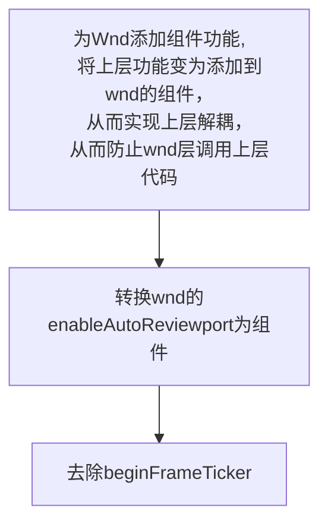
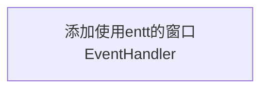
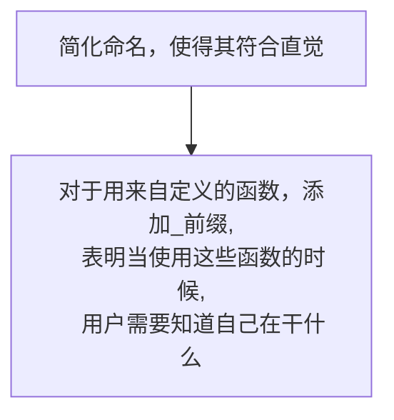

[branch]

```mermaid
graph TD
    1[去除beginFrameTicker]
    2[转换wnd的enableAutoReviewport为组件]
    2-->1
    3[为Wnd添加组件功能,
    将上层功能变为添加到wnd的组件，
    从而实现上层解耦，
    从而防止wnd层调用上层代码]
    3-->2
```
requeire:
使用entt

```mermaid
graph TD
    1[添加使用entt的窗口EventHandler]
```
[main]

```mermaid
graph TD
    1[简化命名，使得其符合直觉]
    2[对于用来自定义的函数，添加_前缀,
    表明当使用这些函数的时候,
    用户需要知道自己在干什么]
    1-->2
```