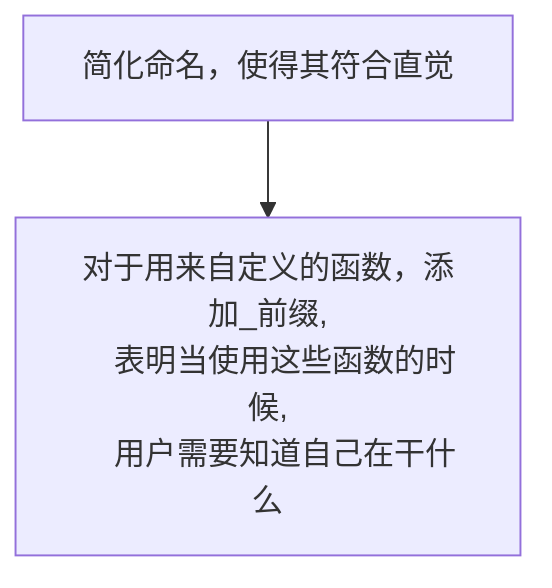
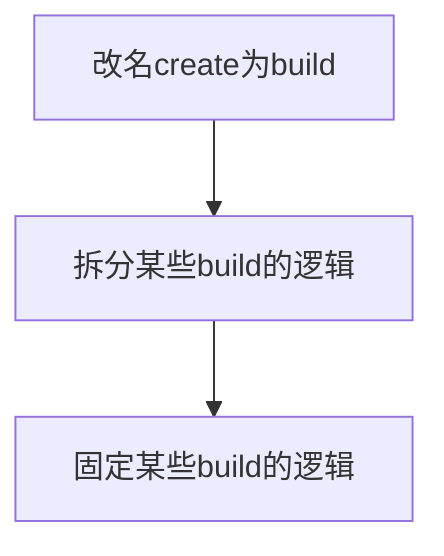

# [branch]
## 添加Window模块
1.添加Window命名空间 
  在Window命名空间下添加归属于Window的模块<div/>
2.Window内部添加一个类型Map，
能根据类型获取对应的模块对象，
如
```c++
AutoViewport av = wnd->getModule<AutoViewport>
```
3.实现添加模块
如
```c++
wnd->addModule<AutoViewport>();
```
4.移除Context中的beginFrameTicker
## 添加事件处理

## 统一new和delete
将不小心使用的new 和 delete 都改为使用FCT_NEW FCT_NEWS FCT_DELETE FCT_DELETES
# [main]


a.g. PipelineResource

