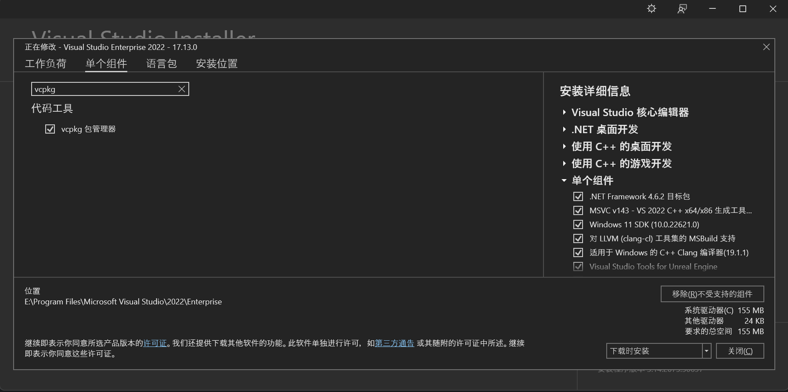
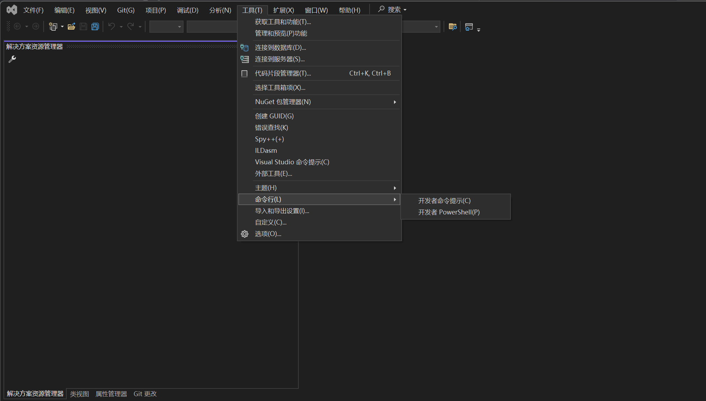
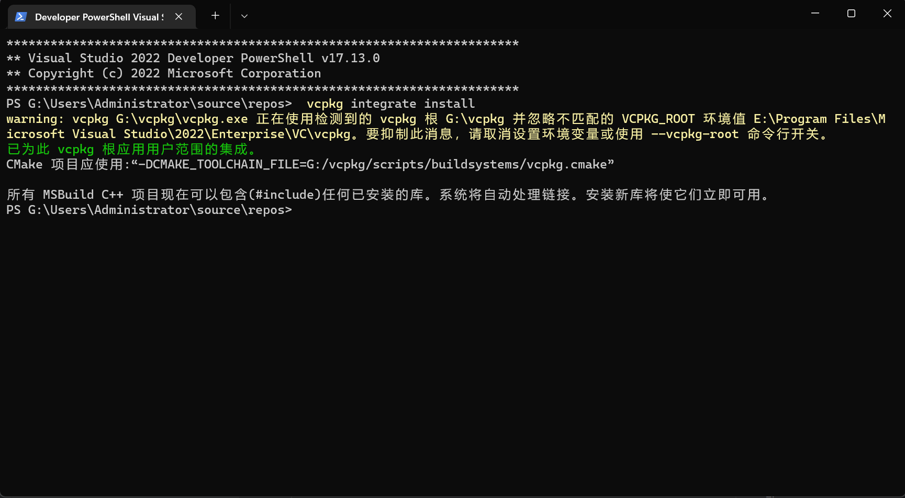
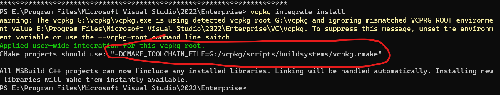
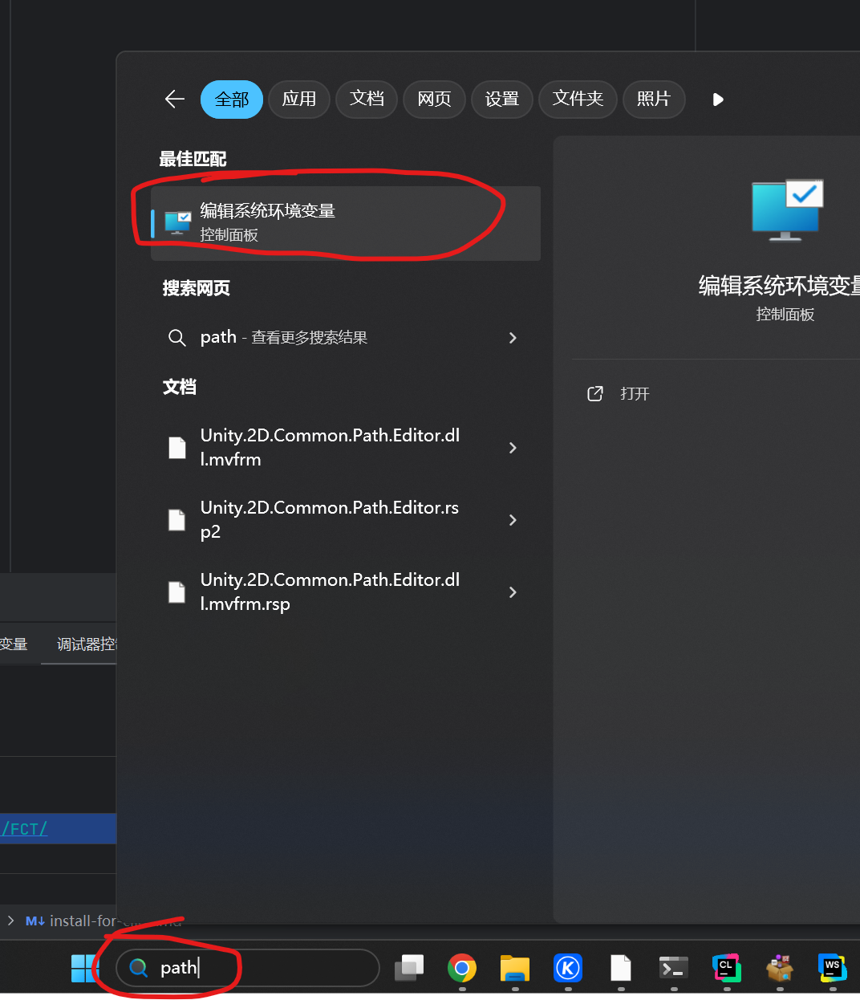
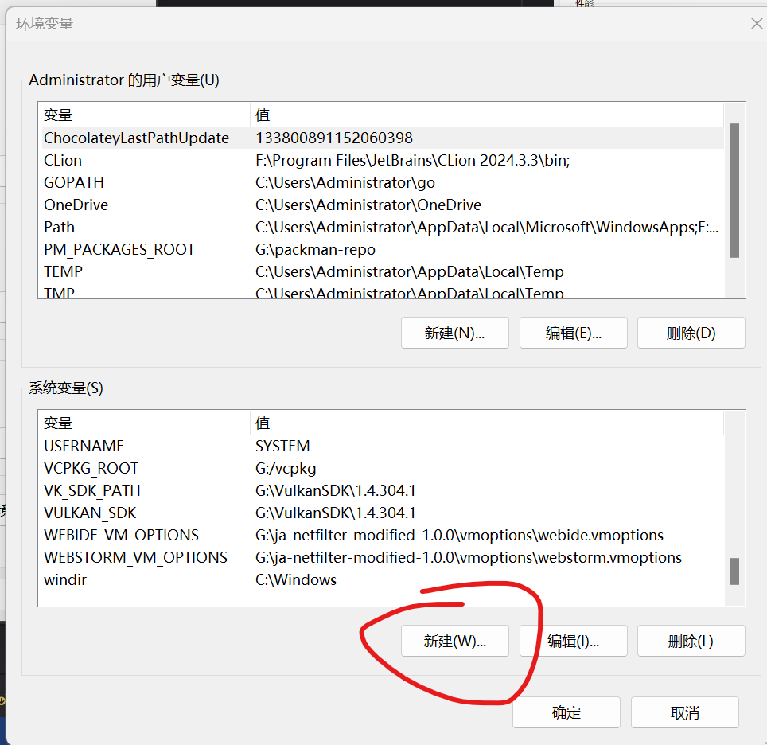
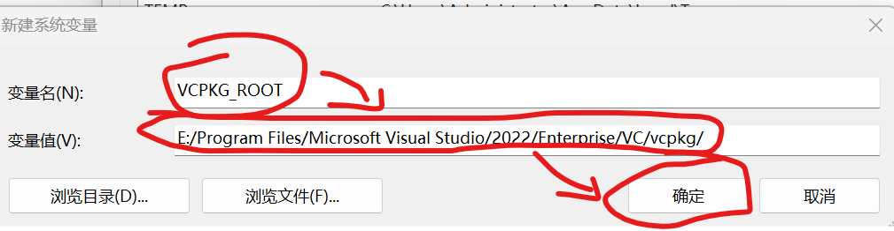

# 配置vcpkg
## 有vs2022，使用vs2022自带vcpkg
### 确认勾选vcpkg


进入visual studio installer
在单个组件处搜索并确认勾选了vcpkg

### 执行vcpkg集成

1.打开vs的命令行，在图中所示位置打开任意vs的命令行，一定要从这里打开

2.执行下列命令
```bash
vcpkg integrate install
```
3.复制运行结果

运行结果将会包含下列
```bash
-DCMAKE_TOOLCHAIN_FILE=G:/vcpkg/scripts/buildsystems/vcpkg.cmake
```
我们复制
-DCMAKE_TOOLCHAIN_FILE=后面到scripts/buildsystems/vcpkg.cmake
比如如果是
```bash
-DCMAKE_TOOLCHAIN_FILE=G:/vcpkg/scripts/buildsystems/vcpkg.cmake
```
我们则复制
```bash
G:/vcpkg/
```
如果是
```bash
-DCMAKE_TOOLCHAIN_FILE=E:/Program Files/Microsoft Visual Studio/2022/Enterprise/VC/vcpkg/scripts/buildsystems/vcpkg.cmake
```
我们则复制
```bash
E:/Program Files/Microsoft Visual Studio/2022/Enterprise/VC/vcpkg/
```
### 设置环境变量以在其它ide中使用（使用vs2022可以不做）


1.搜索path并打开环境变量面板


2.新建变量VCPKG_ROOT，将我们在vcpkg集成哪一步复制的路径粘贴进去
## **到此就可以使用vcpkg了**

---
## 无vs2022,安装额外vcpkg