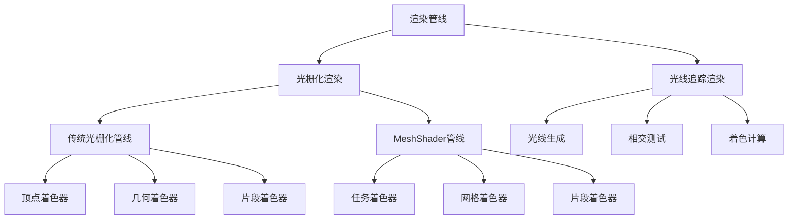
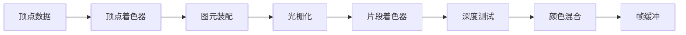
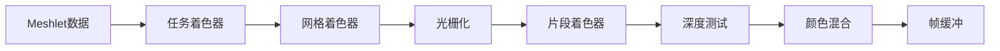

# 渲染管线概述

本指南旨在帮助新加入的FCT库开发者理解不同渲染管线的基本概念和区别。通过掌握这些知识，您将能够更好地修改和扩展FCT库中的管线类层次结构。

## 什么是渲染管线？

渲染管线是将3D模型数据转换为屏幕上像素的过程。不同的渲染管线提供不同的处理方式和效果。

## 渲染管线分类

## 详细分类说明

### 1. 光栅化渲染

光栅化渲染是将3D场景转换为2D图像的传统方法。它通过将3D几何体投影到2D屏幕空间，然后填充像素来工作。

#### 1.1 传统光栅化管线

**工作原理**：
- 顶点处理 → 图元装配 → 光栅化 → 片段处理 → 输出合并

**管线阶段**：

**特点**：
- ✅ 成熟稳定，硬件支持广泛
- ✅ 开发工具完善，学习资源丰富
- ✅ 性能可预测，调试相对简单
- ❌ 几何处理能力有限
- ❌ 难以处理复杂的几何变换

**适用场景**：
- 游戏开发（特别是移动游戏）
- 实时应用
- 初学者学习
- 需要广泛硬件兼容性的项目

#### 1.2 MeshShader管线

**工作原理**：
- 任务着色器 → 网格着色器 → 光栅化 → 片段处理 → 输出合并

**管线阶段**：

**特点**：
- ✅ 更灵活的几何处理能力
- ✅ 支持程序化几何生成
- ✅ 更好的GPU利用率
- ✅ 支持可变速率着色
- ❌ 硬件要求较高（需要现代GPU）
- ❌ 学习曲线陡峭
- ❌ 调试工具相对较少

**适用场景**：
- 复杂场景渲染
- 程序化内容生成
- 高端游戏和应用
- 需要动态几何的场景

### 2. 光线追踪渲染

**工作原理**：
光线追踪通过模拟光线在场景中的传播来生成图像，提供物理准确的光照效果。

**管线阶段**：
\dot
digraph raytracing_pipeline {
rankdir=LR;
node [shape=box, style=filled, fillcolor=lightblue];

    A [label="光线生成"];
    B [label="场景遍历"];
    C [label="相交测试"];
    D [label="着色计算"];
    E [label="反射/折射"];
    F [label="最终颜色"];
    
    A -> B -> C -> D -> E -> F;
}
\enddot

**特点**：
- ✅ 物理准确的光照
- ✅ 真实的反射和折射
- ✅ 自然的阴影效果
- ✅ 全局光照支持
- ❌ 计算成本极高
- ❌ 硬件要求苛刻
- ❌ 实时应用受限

**适用场景**：
- 电影和动画制作
- 建筑可视化
- 产品渲染
- 高质量离线渲染

## 性能对比

| 管线类型 | 渲染速度 | 硬件要求 | 开发难度 | 视觉质量 |
|---------|---------|---------|---------|---------|
| 传统光栅化 | ⭐⭐⭐⭐⭐ | ⭐⭐ | ⭐⭐ | ⭐⭐⭐ |
| MeshShader | ⭐⭐⭐⭐ | ⭐⭐⭐⭐ | ⭐⭐⭐⭐ | ⭐⭐⭐⭐ |
| 光线追踪 | ⭐⭐ | ⭐⭐⭐⭐⭐ | ⭐⭐⭐⭐⭐ | ⭐⭐⭐⭐⭐ |
