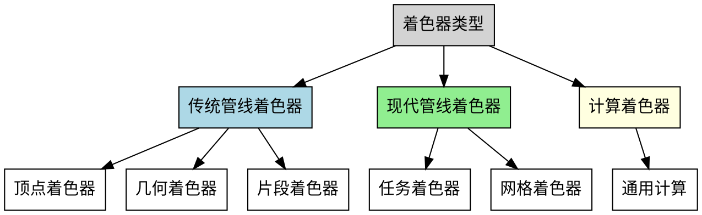
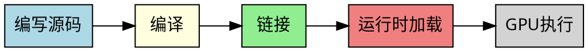

# 着色器概述

本指南旨在帮助FCT库开发者理解着色器的基本概念、类型和工作原理。着色器是现代图形渲染管线的核心组件。

## 什么是着色器？
着色器（Shader）允许用户自定义一段程序在GPU上运行，用于控制图形渲染管线中特定阶段的处理逻辑。它们决定了顶点如何变换、像素如何着色、以及各种视觉效果如何实现。

> <b>FCT库说明</b>：FCT库使用基于HLSL的着色器语言，这是微软开发的高级着色器语言，具有优秀的工具支持和性能表现。

### 核心特点

- <b>并行执行</b>：在GPU的多个核心上同时运行
- <b>专用语言</b>：使用GLSL、HLSL或SPIR-V等着色器语言编写
- <b>管线集成</b>：与图形渲染管线紧密集成
- <b>实时处理</b>：能够实时处理大量数据

## 着色器分类

## 传统管线着色器
### 1. 顶点着色器（Vertex Shader）

<b>功能</b>：处理每个顶点的变换和属性计算

<b>详情了解</b>：
- [顶点着色器详解](vertex_shader.md) - 深入了解顶点处理

### 2. 几何着色器（Geometry Shader）

<b>功能</b>：处理图元（点、线、三角形），可以生成新的几何体

<b>详情了解</b>：
- [几何着色器详解](geometry_shader.md) - 几何处理技术

### 3. 像素着色器（Pixel Shader / Fragment Shader）

<b>功能</b>：计算每个像素的最终颜色

> <b>注意</b>：像素着色器也被称为片段着色器（Fragment Shader），两个术语指的是同一个概念。在DirectX中通常称为像素着色器，在OpenGL中通常称为片段着色器。

<b>详情了解</b>：
- [像素着色器详解](pixel_shader.md) - 像素着色技术

## 现代管线着色器

### 1. 任务着色器（Task Shader）

<b>功能</b>：决定哪些网格着色器工作组需要执行

<b>详情了解</b>：
- [任务着色器详解](task_shader.md) - 工作负载管理

### 2. 网格着色器（Mesh Shader）

<b>功能</b>：生成图元和顶点数据

<b>详情了解</b>：
- [网格着色器详解](mesh_shader.md) - 现代几何处理

## 计算着色器（Compute Shader）

<b>功能</b>：执行通用并行计算任务

<b>详情了解</b>：
- [计算着色器详解](compute_shader.md) - 通用GPU计算

## 着色器语言对比

| 语言 | 平台支持 | 特点 | 适用场景 | FCT使用 |
|------|---------|------|---------|---------|
| GLSL | OpenGL/Vulkan | 类C语法，跨平台 | 通用图形开发 | ❌ |
| HLSL | DirectX | 微软生态，工具完善 | Windows平台开发 | ✅ **FCT基于此** |
| SPIR-V | Vulkan/OpenCL | 中间表示，高性能 | 现代图形API | ❌ |
| MSL | Metal | 苹果平台专用 | iOS/macOS开发 | ❌ |

## 着色器开发流程

### 开发步骤

1. <b>设计阶段</b>：确定着色器功能和输入输出
2. <b>编码阶段</b>：使用着色器语言编写代码
3. <b>编译阶段</b>：将源码编译为中间代码或机器码
4. <b>集成阶段</b>：将着色器集成到渲染管线中
5. <b>调试阶段</b>：使用图形调试工具进行优化

## 性能优化建议

### 通用优化

- <b>减少分支</b>：避免复杂的条件语句
- <b>向量化操作</b>：充分利用GPU的向量处理能力
- <b>纹理优化</b>：合理使用纹理格式和过滤方式
- <b>精度控制</b>：根据需要选择合适的数据精度

### 顶点着色器优化

- 预计算不变的变换矩阵
- 减少顶点属性数量
- 使用实例化渲染减少draw call

### 像素着色器优化

- 早期深度测试
- 减少纹理采样次数
- 优化光照计算复杂度

## 调试工具

- <b>RenderDoc</b>：跨平台图形调试器
- <b>NVIDIA Nsight</b>：NVIDIA GPU专用调试工具
- <b>AMD GPU PerfStudio</b>：AMD GPU性能分析
- <b>Intel GPA</b>：Intel集成显卡调试工具

## 相关文档

## 总结

着色器是现代图形编程的核心，理解不同类型着色器的功能和特点对于开发高质量的图形应用至关重要。在FCT库的开发中，我们需要：

1. 根据目标平台选择合适的着色器语言
2. 设计灵活的着色器管理系统
3. 提供易用的着色器编译和加载接口
4. 支持着色器的热重载和调试功能

通过掌握这些知识，你将能够更好地参与FCT库中着色器相关功能的开发和维护。
